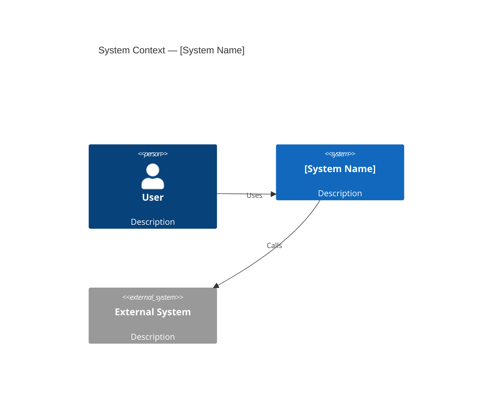
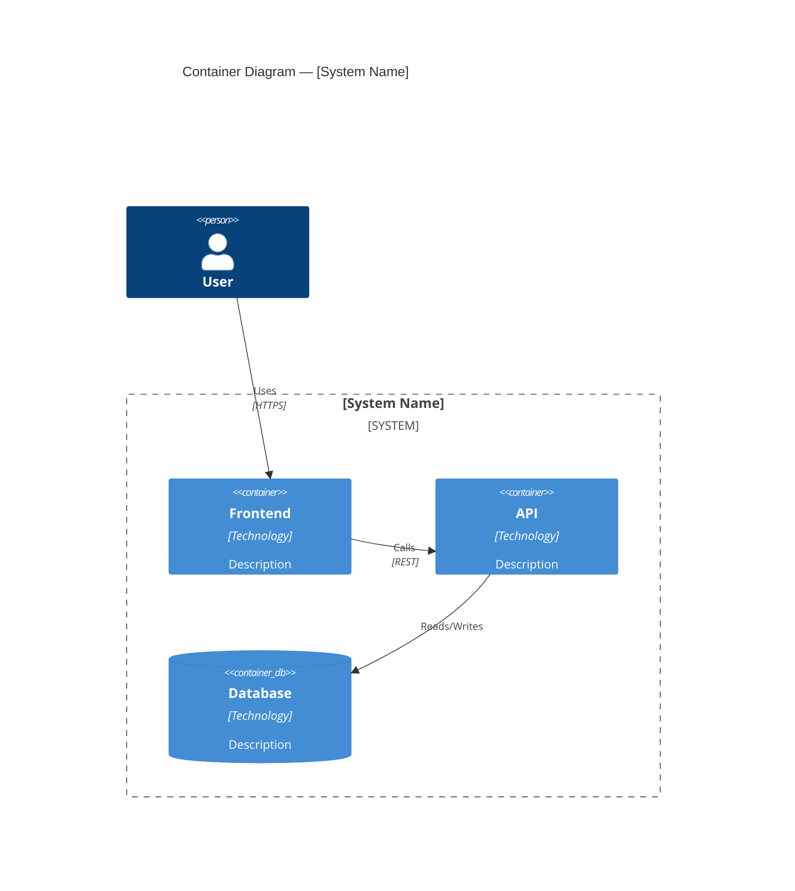
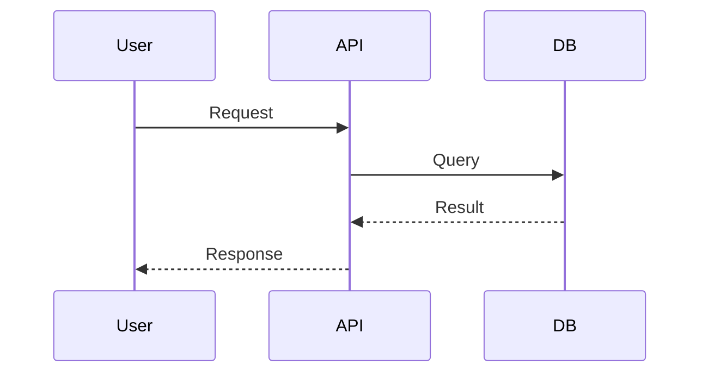
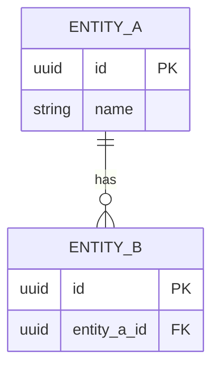

# Architecture Document — [System Name]

> **Version:** 1.0  
> **Date:** YYYY-MM-DD  
> **Author(s):** [Name(s)]  
> **Status:** Draft | Under Review | Approved

---

## 1. Overview

<!-- 2–3 sentences describing what this system does and why it exists. -->

**Primary goal:**

**Key stakeholders:**

---

## 2. Functional Requirements (summary)

| ID | Requirement | Priority |
|----|-------------|----------|
| FR-01 | | High |
| FR-02 | | Medium |

---

## 3. Non-Functional Requirements

| Category | Requirement | Target |
|----------|-------------|--------|
| Availability | SLA | 99.9% |
| Latency | p95 response time | < 300 ms |
| Throughput | Requests per second | X RPS |
| Data retention | | X days / years |
| Security | Auth standard | OAuth 2.0 + OIDC |
| Compliance | | GDPR / HIPAA / PCI |
| RTO | Recovery time | < X hours |
| RPO | Data loss tolerance | < X minutes |

---

## 4. Constraints

- **Technical:** (existing tech stack, supported cloud provider, language restrictions)
- **Organizational:** (team size, skill set, budget)
- **Regulatory:** (data residency, compliance requirements)

---

## 5. Architectural Style & Justification

**Chosen style:** (e.g., Modular Monolith / Microservices / Event-Driven / Serverless)

**Rationale:**

**Alternatives considered:**

| Option | Pros | Cons | Reason rejected |
|--------|------|------|-----------------|
| | | | |

---

## 6. System Context (C4 Level 1)

<!-- Paste Mermaid C4Context diagram here -->

---

## 7. Container Breakdown (C4 Level 2)

<!-- Paste Mermaid C4Container diagram here -->

---

## 8. Key Interfaces & Data Flows

### 8.1 API contracts

| Interface | Protocol | Auth | Notes |
|-----------|----------|------|-------|
| | REST / gRPC / GraphQL | | |

### 8.2 Key sequence — [flow name]

---

## 9. Data Model

<!-- ERD or table definitions -->

---

## 10. Storage Strategy

| Data | Store | Reason |
|------|-------|--------|
| | PostgreSQL / MongoDB / Redis / S3 | |

---

## 11. NFR Coverage

| NFR | Mechanism | Owner |
|-----|-----------|-------|
| Availability | Multi-AZ deployment, health checks | Ops |
| Scalability | Horizontal pod autoscaling | Platform |
| Security | mTLS, secrets manager, WAF | Security |
| Observability | OpenTelemetry + Prometheus + Grafana | Platform |

---

## 12. Risks & Mitigations

| Risk | Likelihood | Impact | Mitigation |
|------|-----------|--------|------------|
| | H/M/L | H/M/L | |

---

## 13. Architecture Decision Records

<!-- Link or embed ADRs here -->

- [ADR-001: Choice of architectural style](./adr/ADR-001-architectural-style.md)
- [ADR-002: Database selection](./adr/ADR-002-database-selection.md)

---

## 14. Open Questions

| # | Question | Owner | Due |
|---|----------|-------|-----|
| 1 | | | |

---

## 15. Next Steps

- [ ] Review with engineering team
- [ ] Finalize ADRs
- [ ] Define detailed API contracts (OpenAPI spec)
- [ ] Proof of concept for highest-risk component
